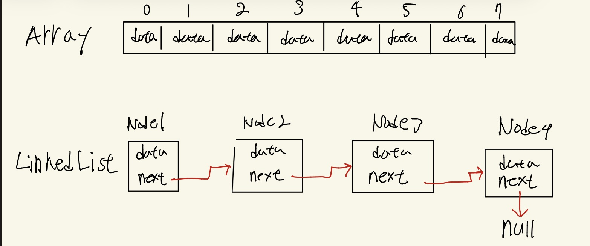

<br>


배열은 영화관 좌석 같이 따닥따닥 붙어 있고, 번호가 매겨져 있습니다.<br>
메모리상 연속적이라 누군가를 끼워 앉게 하려면 그 뒤 모든 사람은 한칸 씩 뒤로 움직여야하는데,<br>
이러면 너무 불필요한 연산을 많이 하게 되는데, 이런걸 피하려고 연결 리스트를 사용합니다.

그러면 연결 리스트란 뭘까요?<br>
첫번째 장소에 데이터와 다음 장소로 가는 약도가 있고요,
서로 떨어져 있어도 상관이 없습니다. 즉, 메모리상 비연속적이에요.<br>
따라서 데이터를 추가하거나 삭제할때 더 효율적입니다.

```java
class Node {
	int data;
	Node next; // 다음번 주소를 가리키는 참조 변수
	
	public Node(int d) {
		this.data = d; //이 노드가 가지고 있는 데이터.
		this.next = null; //현재 노드는 다음으로 가는 노드를 가리키고 있지 않음.
	}
}
```

이런 식으로 작성하면 됩니다.

```	java
public class Main {
    public static void main(String[] args) {
        Node node1 = new Node(10);
        Node node2 = new Node(20);

		node1.next = node2; //노드1의 다음이 node2를 가리킴.
    }
}
```
만일 node1.next.data이라면 노드1 다음것의 데이터 겠죠?
따라서 node2.data랑 같습니다.

예시 코드
```java
class Node {
    int data;
    Node next;
    
    public Node(int d) {
        this.data = d;
        this.next = null;
    }
}

public class Main {
    public static void main(String[] args) {
        // 노드 생성
        Node node1 = new Node(10);
        Node node2 = new Node(20);
        Node node3 = new Node(30);

        // 연결
        node1.next = node2;
        node2.next = node3;
        // node3.next는 자동으로 null. 왜냐하면 기본 생성자에서 this.next = null이니깐.

        // 확인
        Node current = node1;
        while (current != null) {
            System.out.println(current.data);
            current = current.next; // 다음 칸으로
        }
    }
}
```

다만 위 코드는 그냥 이해를 위한 예시일뿐 코드 짤때는 끙끙거리지 말고, 그냥 자바에서 가본적으로 제공하는 ArrayList와 LinkedList 쓰면 됩니다.
ArrayList 요녀석은 길이를 스스로 줄였다가 늘릴 수 있는 가변형 배열입니다.
LinkedList 요 친구가 연결리스트구요.

그럼 배열(혹은 ArrayList)은 언제 쓰냐?<br>
데이터가 자주 바뀌거나 삭제 되지 않고, 몇번 데이터가 필요한 조회가 많을때 주로 씁니다.<br>
사실상 대부분의 상황에서 쓴다는 뜻이죠.<br>
예시로 뭐 웹사이트 만들때 페이지네이션 하잖아요? 그럴때 쓰는겁니다.

50번째 데이터 조회하고 싶으면 50번째 데이터를 바로 찾을 수 있어서 O(1) 만큼 걸려요.
근데 연결리스트에서 50번째 데이터 찾아가려면? O(n) 만큼 걸릴 수 있음.<br>
참고로 O()는 빅오표기법이라고 하는데, 데이터가 늘어날 때 시간이 얼마나 더 걸리는지 나타내는 것으로,작을수록 빠르고 좋다라고 알고계시면 될것같네요.<br>

연결 리스트는 앞서 언급한대로, 중간 삽입이나 삭제가 많은 경우에 쓰면 딱이겠죠?<br>
뭐 유튜브 플레이리스트 하나 만든다고 해봅시다. 맨뒤에만 들어가지 않고, 중간에도 넣을 수 있죠?<br>
그럴때 주로 사용하면 되겠습니다.