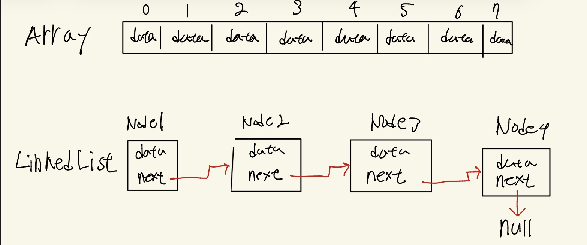

<br>


배열은 영화관 좌석 같이 따닥따닥 붙어 있고, 번호가 매겨져 있습니다.<br>
메모리상 연속적이라 누군가를 끼워 앉게 하려면 그 뒤 모든 사람은 한칸 씩 뒤로 움직여야하는데,<br>
이러면 너무 불필요한 연산을 많이 하게 되고, 이런걸 피하려고 연결 리스트를 사용합니다.

그러면 연결 리스트란 뭘까요?<br>
첫번째 장소에 데이터와 다음 장소로 가는 약도가 있고요,
서로 떨어져 있어도 상관이 없습니다. 즉, 메모리상 비연속적이에요.<br>
따라서 데이터를 추가하거나 삭제할때 배열보다 더 효율적입니다.<br>
단, 조건이 하나가 있는데, 자리를 알고 있어야 합니다.

그런데, 만약에 영화관 좌석이 10000석이라고 칩니다.<br>
그리고 제 자리는 5000번이에요. 그런데 이 영화관에서 연결 리스트 처럼 좌석을 만들어 놨습니다.<br>
1번 좌석으로 가니, 다음 좌석은 2번 여기서 저기 위로 가시면 됩니다.<br>
라고 말하고 2번 좌석가니, 여기서 저기 아래 옆으로 가면 3번 좌석 입니다.<br>

이렇게 알려주겠죠. 이러면 5000번 까지 언제 찾아갑니까?<br>
결국 5000번째에 누군가를 새로 끼워 넣으려면(삽입), 선을 끊고 연결하는 건 1초 만에 끝나더라도<br>
애초에 그 5000번째 자리를 찾아가는 데 한 세월이 걸립니다.<br> 

반면 그냥 배열(ArrayList)처럼 만들면, 번호만 알면 5000번 좌석으로 한 번에 갈 수 있겠죠?<br>
그래서 중간에 데이터를 자주 넣고 빼더라도, 그 자리를 '찾아가는 시간'까지 고려하면 <br>
그냥 배열을 밀어내는 게 더 빠를 때가 많습니다.


다음은 연결리스트 코드에 대해서 살짝 알아봅시다.
```java
class Node {
	int data;
	Node next; // 다음번 주소를 가리키는 참조 변수
	
	public Node(int d) {
		this.data = d; //이 노드가 가지고 있는 데이터.
		this.next = null; //현재 노드는 다음으로 가는 노드를 가리키고 있지 않음.
	}
}
```
이런 식으로 작성하면 됩니다.

```java
public class Main {
    public static void main(String[] args) {
        Node node1 = new Node(10);
        Node node2 = new Node(20);

		node1.next = node2; //노드1의 다음이 node2를 가리킴.
    }
}
```
만일 node1.next.data이라면 노드1 다음것의 데이터 겠죠?
따라서 node2.data랑 같습니다.

예시 코드
```java
class Node {
    int data;
    Node next;
    
    public Node(int d) {
        this.data = d;
        this.next = null;
    }
}

public class Main {
    public static void main(String[] args) {
        // 노드 생성
        Node node1 = new Node(10);
        Node node2 = new Node(20);
        Node node3 = new Node(30);

        // 연결
        node1.next = node2;
        node2.next = node3;
        // node3.next는 null. 왜냐하면 생성자에서 this.next = null로 해줬으니깐.

        // 확인
        Node current = node1;
        while (current != null) {
            System.out.println(current.data);
            current = current.next; // 다음 칸으로
        }
    }
}
```
다만 위 코드는 그냥 이해를 위한 예시일뿐 코드 짤때는 끙끙거리지 말고, 그냥 자바에서 기본적으로 제공하는 ArrayList(배열)와 LinkedList(연결리스트) 쓰면 됩니다.

ArrayList 요녀석은 길이를 스스로 늘릴 수 있는 가변형 배열입니다. int[], String[] 요런 녀석들은 크기가 고정인데, ArrayList는 크기가 고정되어있지 않습니다. 앞으로는 리스트라고 칭하겠습니다.
LinkedList 요 친구가 연결리스트구요.<br>

친근한 사이인 ArrayDeque같은 녀석도 있는데, 이 녀석같은 경우는 중간이 아니라, 앞/뒤에서 데이터를 집어넣고 빼는데 주로 사용합니다.<br>
또 리스트가 가지고 있는 번호표(인덱스라고 합니다)가 없습니다. [다음 시간](/posts/queue-stack/)에 알아보도록 할거구요. 


그럼 리스트는 언제 쓰냐?<br>
중간에 데이터를 넣고 빼는 일은 적고, 몇 번째 데이터인지로 찾는 일이 많을 때 주로 씁니다.<br>
사실상 대부분의 상황에서 쓴다는 뜻이죠.<br>
예시로 뭐 웹사이트 만들때 페이지네이션 하잖아요? 그럴때 쓰는겁니다.

리스트는 번호만 알면, 거기 해당하는 데이터를 바로 찾을 수 있어서 O(1) 만큼 걸려요.
근데 연결리스트에서 50번째 데이터 찾아가려면? 아까 비유했던거 처럼, 여기갔다가 저기갔다가 해서 O(n) 만큼 걸립니다.<br>
참고로 O()는 빅오표기법이라고 하는데, 데이터가 늘어날 때 시간이 얼마나 더 가파르게 늘어나는지를 표시해주는 건데, 데이터가 많으면 많을 수록 차이가 크게 난다~ 정도로 알고계시면 될것같네요.<br>


> 2026-08-24 내용 일부 수정
{: .prompt-info }