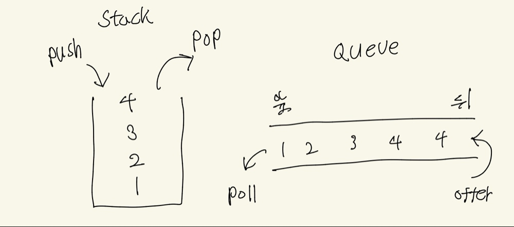

오늘은 큐와 스택에 대해서 간단하게 알아봅시다.



스택은 그냥 프링글스 통이라고 생각하면 됩니다.<br>
Last in First Out줄여서 LIFO인데,
위에서 하나씩 꺼내먹죠.(pop)<br>
넣을때도 밑에서 못넣죠.
위에서 넣어야 합니다.(push)<br>
참고로, 우리가 많이쓰는 ctrl + z 같은거도 스택입니다.<br>

큐는 그냥 줄서기에요.<br>
놀이 공원 놀러가면 줄서는데 나보다 뒤에 선 사람이 먼저 들어가면 화나잖아요?<br>
그럴때 쓰는게 큐입니다.<br>
이 친구는 First in First Out이라고, 줄여서 FIFO라고 합니다.<br>
뒤에서 줄서고(offer) 앞에서 나가요(poll)
주로 이제 게임에서 큐 돌린다고 많이 말하잖아요. 그럴때 씁니다.

자바에서는 스택과 큐 안에 정수를 넣는다고 가정하면
```java
//스택
Stack<Integer> stack = new Stack<>();
stack.push(1); //stack에 1 넣음
stack.push(2); //stack에 2 넣음
stack.pop(); // 2꺼냄
stack.peek(); // 안꺼내고 맨위에 뭐가 있는지 확인만함.


//큐
Queue<Integer> q = new LinkedList<>();
q.offer(1); //1넣음
q.offer(2); //2넣음
q.poll(); // 1 튀어 나옴
```
이렇게 가능합니다.

그런데 안에 비어있다면 어떨까요?
큐와 스택안에 아무것도 없다고 가정하고, pop과 poll을 해보면,
```java
q.poll(); //null 반환
stack.pop(); // EmptyStackException 예외발생
```
이렇게 됩니다.<br>

요즘은
```java
ArrayDeque<Integer> arrayDeque = new ArrayDeque<>();
```
이걸 많이 씁니다.<br>
Array는 배열이고, Deque은 큐인데, 양방향이 뚫려있는 거라고 생각하면 됩니다.
Double-ended Queue의 약자고요.

```java
ArrayDeque<Integer> ad = new ArrayDeque<>();
        
ad.offerFirst(1);// 맨앞에 1넣음
ad.offerLast(2); // 맨뒤에 2 넣음
ad.poll();
ad.pop();
```
양방향이 뚫려있으니깐, 앞뒤로 넣고 빼는게 가능합니다.<br>
왜 이걸 더 많이 쓰냐면, 얘는 큐도 되고 스택도 됩니다. 편하죠?<br>
그리고 Vector를 상속받지 않아서 더 빨라요. <br>
Stack 클래스는 고대 자바에 유산 같은거라 설계가 좀 구식이고, 무조건 안전장치(Lock)를 걸어놔서 꽤 느려요. 그래서 요즘은 훨씬 빠르고 가벼운 ArrayDeque을 씁니다.

엥? 그러면 큐도 되고 스택도 되면 나중에 여러명이서 코드짜다가 문제 생기는거 아니에요? 라고 물으실 수 있는데, 맞습니다.<br>

특히나
```java 
ad.poll();
ad.pop();
```
이런식으로 짜버리면 큐야 스택이야? 하면서 엄청 헷갈리겠죠.

그래서 명시적으로
```java
Queue<Integer> queue = new ArrayDeque<>();
queue.offer(1);
queue.poll();
//또는
Deque<Integer> stack = new ArrayDeque<>();
stack.push(1);
stack.pop();

//빈 ArrayDeque에서도 pop과 poll할시 아까와 똑같습니다.
q.poll(); //null 반환
stack.pop(); // EmptyStackException 예외발생
```
이렇게 인터페이스로 타입을 묶어 누구나 알 수 있게 스택인지 큐인지 써놓고, 그에 맞게 사용하면 될것같습니다.<br>
주석 안써도 알아보기 쉽겠죠?<br>
근데 stack이 아니라 왜 deque이냐고요?<br>
stack은 오래되서 ArrayDeque이랑 일단 호환이 안되고, 자바 doc에서 Deque을 LIFO 스택으로 사용할 것을 권장했습니다.<br>

(참고 : https://docs.oracle.com/en/java/javase/21/docs/api/java.base/java/util/Deque.html)<br>

또 눈썰미 좋은 분들은, 어? 아까는 큐 만들때 LinkedList썼는데 지금은 ArrayDeque 쓰네요? 라고 물으실건데,<br>
[이전 글](/posts/java-LinkedList/) 참고하시면, 연결리스트 같은 경우에는 어떤 장소에 데이터와 다음 장소로 가는 약도가 있고요, 서로 떨어져 있어도 상관이 없는, 메모리상 비연속적인 자료구조인데, 막 노드안에 뭐 넣고 다음에 어디갈지 지정해주고 그래야 하잖아요?<br>
그래서 느려요. 그래서 이친구도 마찬가지로, ArrayDeque씁니다.<br>
빠르고 메모리도 적게 먹으니깐요.

그렇지만 무조건적으로 배열 기반(ArrayDeque 등)만 쓰는 건 또 아닙니다.<br>
프링글스 통 중간을 칼로 잘라서 감자칩을 빼먹거나, 놀이공원 줄 한가운데로 새치기해야 하는 특수한 상황중간 삽입/삭제라면 데이터들이 손에 손을 잡고 있는 LinkedList가 여전히 의미가 있습니다.<br>
물론 요즘 컴퓨터들은 성능이 워낙 좋아서, 중간에 새치기할 때 아예 뒷사람들을 다 밀어내고 줄을 새로 세우는 ArrayList 같은 배열 방식이 더 빠를 때도 많을때가 있습니다.<br>

제가 컴퓨터 공부하면서 가장 싫어하는 말이 있는데, 제가 그말을 하게 될줄은 몰랐네요.<br>
'상황에 맞게 쓰면 됩니다.'

isEmpty()같은 메소드도 있는데, 이 글은 그런거 보다는 그냥 큐랑 스택이 어떻게 굴러가는지 원리에 대해서 알아보는 글이니깐, ai에게 물어보거나 구글 검색해봅시다.<br>
사실 저도 문제 풀거나 할때, 매번 까먹어서 물어봅니다.