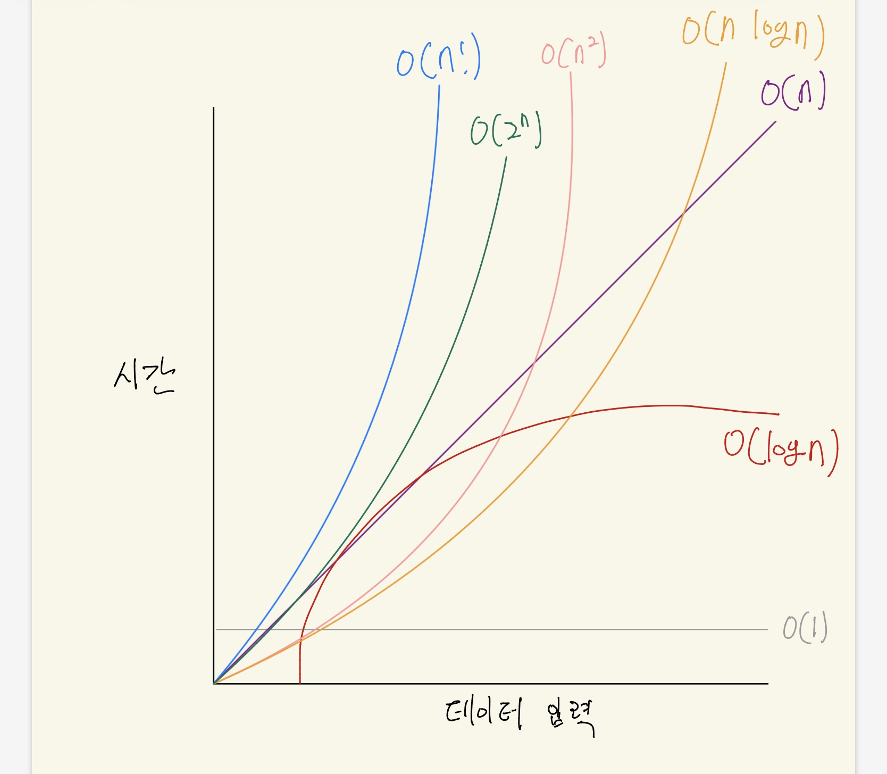

시작 하기에 앞서, 우리가 코드를 짜는데 왜 이런걸 배워야 할까요? 
저는 개인적으로 코드를 짜는거는 문제를 해결하는거 라고 생각합니다. 
복잡하게 생각할거 없이, 웹사이트를 짜는데, 서버단에서 X데이터 가져와서 정렬한 다음에 디자인에 맞게 출력해주세요. 
이런 문제를 해결하는 방법중에 하나라고 봅니다. 
그래서 이론과 배경지식을 많이 알수록 더 많은 해결 방법을 시도 해 볼 수 있고, 그래서 자료 구조와 알고리즘을 배우는 거에요. 

자료구조는 데이터구성하고 저장하는 법을 설명하고, 식별하는 방법을 제공하고 데이터의 관계를 보여주는 개념입니다. 
무슨말인지 모르겠죠? 저도 이것만 읽으면 몰라요. 
그냥 쉽게 데이터를 담는 그릇이라고 생각해봅시다. 

그러면 예시로 라면이라는 데이터가 있습니다. 
'신라면' '진라면' '신라면' '진라면'

'신라면' '신라면' '진라면' '진라면' 
이런식으로 데이터를 정렬할 수 도있고,

'0'     '1'     '2'     '3' 
'신라면' '진라면' '신라면' '진라면' 
이런식으로 번호를 붙여 인덱스를 붙여줄 수 있습니다. 이게 배열이에요. 
2번 라면 줘 하면 신라면을 바로 받을 수 있겠죠?

이거 얼마되지도 않는거 구분하는게 더 오래걸리는거 아니에요? 라고 하실 수 있겠는데, 
라면 공장에서 라면이 마구마구 나오는데 구분없이 섞여 나온다고 생각해봅시다. 
포장하는데 엄청 오래걸리겠죠? 
서버도 똑같아요. 수십, 수만 건의 데이터가 드나드는데 구분이 없으면 엄청 오래걸리겠죠? 

그런데, 자료구조만으로는 부족해요. 
배열로 데이터를 잘 담아놨는데, 그럼 수만 건 중에서 원하는 걸 어떻게 빨리 찾을까요? 그게 알고리즘의 역할이에요. 
알고리즘이 뭐냐면, 그냥 라면끓이기에요. 
1.찬장을 연다. 
2.라면을 꺼낸다. 
3.봉투를 뜯는다. 
4.물을 냄비에 붓는다. 
5.끓인다. 
6.스프를 넣는다. 
이런식으로 쭉 가잖아요? 

뭐 어떤 사람은 면부터 넣고, 어떤 사람은 물 500미리를 전자저울에다가 정확하게 달아서 넣고, 누구는 500미리 병을 써서 빠르게 물을 채우고, 
같은 라면 끓이는 방식인데 방법이 엄청많죠? 사람마다 끓이는 시간도 다르고요. 
이런게 알고리즘 입니다. 우리가 라면을 끓일때 가장 맛있고, 빠르게 끓이는 방법을 찾아야하듯, 
문제를 풀때도 빠르고 효율적인 알고리즘을 찾아써야해요. 

그러면 흑백요리사 처럼 맛 평가해주듯이 알고리즘 평가하는것도 있나요? 
네. 있습니다. 빅오표기법이라고 해요. 
오메가, 세타, 리틀오 등등이 있는데, 빅오를 가장 많이 사용해요. 
왜 빅오나면, 대문자O를 사용하거든요. 
O(n) 이런식으로 표시합니다. 

그림으로 한번 봅시다.

O(1)은 상수 시간이에요. 라면이 아무리 많아도, 3번째 라면 꺼내주세요.라고 말하면 바로 꺼내줄 수 있겠죠?

O(n)은 하나하나 다 찾아 보는거에요. 라면 1000개가 있는데 그중에서 너구리 찾아주세요~ 라고 하면 
하나하나 다 뒤져 봐야겠죠? 우리가 자주 쓰는 문법 있잖아요? for문. 이거에요. 

O(log n)은 업다운 게임 아시나요? 1 ~ 100까지 숫자를 맞추는 게임중에서, 50을 부르면 큰지 작은지 알려주겠죠. 또 거기서 절반, 또 거기서 절반으로 해서 찾는거에요. 
데이터가 10000개 있다고 해도, 5000(1번) - 2500(2번) - 1250(3번) -.... 이런식으로  얼마 안늘어나요. 
그래서 그래프가 데이터가 많아져도 평평한거에요. 

O(nlogn)은 업다운을 라면 전체에 적용한다고 생각하면 좀 편합니다.라면 더미를 반반씩 계속 쪼개서 각각 정렬한 다음 합치는 방식이에요. O(n)보다는 느리지만 현실에서 쓰이는 정렬 알고리즘 중엔 가장 빠른 축에 속하겠죠. 

O(n²)은 1번부터 100번까지 찬장이 있고, 그 찬장 마다 100개의 라면이 있다고 칩시다. 
거기서 너구리 찾아달라고 하면, 1번 찬장에 라면을 1번부터 100번까지 확인 다 하고, 
2번 찬장에 1번부터 100번까지.... 
이걸 100번 반복하겠죠? 
어디서 많이 본거 같지 않나요? 
네 이중 for문이네요.

O(2ⁿ)은 라면 하나 추가될 때마다 경우의 수가 2배씩 늘어나는 거예요. 
10개면 1024번, 20개면 백만 번 넘어가요. 종이를 한 번 접으면 2겹, 두 번 접으면 4겹, 세 번 접으면 8겹이에요. 
접을수록 2배씩 늘어나는 것처럼, 데이터 하나 늘 때마다 연산이 2배씩 늘어나요. 

O(n!)은 뭔가요? 
이거는 라면을 전부 다 가능한 순서대로 다 나열하는거에요. 
3개로 예시를 들면, 신라면,진라면,열라면 있으면 
신|진|열 
신|열|진 
진|신|열 
진|열|신 
열|진|신 
열|신|진 
이거 다 시도하는거에요. 
3개 짜리 하는데도 6개 나오는데 데이터 많아지면 엄청 오래 걸리겠죠? 

그래프를 다시 보면, 선이 완만할수록 좋은 알고리즘이에요. 우리가 코드를 짤 때 가능하면 O(1)이나 O(log n)에 가까운 방법을 찾는 게 목표예요.  
그냥 짧게말해라면을 가장 빠르게 찾는 방법을 고르는 거예요. 그게 좋은 알고리즘이에요. 
