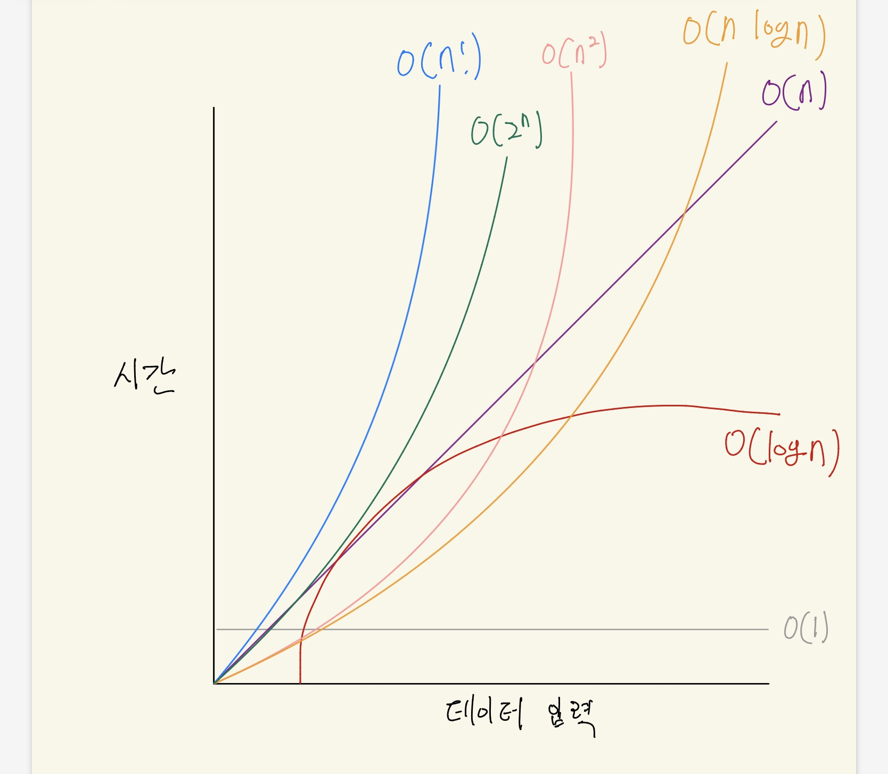

## 자료구조, 알고리즘 그리고 빅오

우리가 코드를 짜는데 왜 이런걸 배워야 할까요?

저는 개인적으로 코드를 짜는거는 문제를 해결하는거 라고 생각합니다.

복잡하게 생각할거 없이 웹사이트를 짜는데,<br>
"서버단에서 X데이터 가져와서 정렬한 다음에 그중에서 조건에 맞는것만 디자인에 맞게 출력해주세요."<br>
이런 문제를 해결하는 방법중에 하나라고 봅니다.

그래서 이론과 배경지식을 많이 알수록 더 많은 해결 방법을 시도 해 볼 수 있고,<br>
그래서 자료 구조와 알고리즘을 배우는 거에요.

## 자료구조

자료구조는 데이터구성하고 저장하는 법을 설명하고,<br>
식별하는 방법을 제공하고 데이터의 관계를 보여주는 개념입니다.<br>

무슨말인지 모르겠죠? 저도 이것만 읽으면 몰라요.<br>
그냥 쉽게 데이터를 담는 그릇이라고 생각해봅시다.

그러면 예시로 라면이라는 데이터가 있습니다.<br>

```text
'신라면' '진라면' '신라면' '진라면'
```

이런걸

```text
'신라면' '신라면' '진라면' '진라면'
```

이런식으로 데이터를 정렬할 수 도있고

```text
'0'     '1'     '2'     '3'
'신라면' '진라면' '신라면' '진라면'
```
이런식으로 번호를 붙여 인덱스를 붙여줄 수 있습니다. 이게 배열이에요.<br>
2번 라면 줘 하면 신라면을 바로 받을 수 있겠죠?

이거 얼마되지도 않는거 구분하는게 더 오래걸리는거 아니에요? 라고 하실 수 있겠는데,<br>
라면 공장에서 라면이 마구마구 나오는데 구분없이 섞여 나온다고 생각해봅시다.<br>
포장하는데 엄청 오래걸리겠죠?

서버도 똑같아요. 수십, 수만 건의 데이터가 드나드는데 구분이 없으면 엄청 오래걸리겠죠?<br>

그런데, 자료구조만으로는 부족해요.<br>
배열로 데이터를 잘 담아놨는데, 그럼 수만 건 중에서 원하는 걸 어떻게 빨리 찾을까요?<br> 
그게 알고리즘의 역할이에요.

## 알고리즘

알고리즘이 뭐냐면, 그냥 라면끓이기에요.

```text
1.찬장을 연다.
2.라면을 꺼낸다.
3.봉투를 뜯는다.
4.물을 냄비에 붓는다.
5.끓인다.
6.스프를 넣는다.
```

이런식으로 쭉 가잖아요?

뭐 어떤 사람은 면부터 넣고,<br> 
어떤 사람은 물 500미리를 전자저울에다가 정확하게 달아서 넣고,<br>
누구는 500미리 병을 써서 빠르게 물을 채우고 등등등....

같은 라면 끓이는 방식인데 방법이 엄청많죠? 사람마다 끓이는 시간도 다르고요.

이런게 알고리즘 입니다. 우리가 라면을 끓일때 가장 맛있고, 빠르게 끓이는 방법을 찾아야하듯,<br>
문제를 풀때도 빠르고 효율적인 알고리즘을 찾아써야해요.

그러면 흑백요리사 처럼 맛 평가해주듯이 알고리즘 평가하는것도 있나요?<br>

## 빅오

네. 있습니다. 빅오표기법이라고 해요.<br>
오메가, 세타, 리틀오 등등이 있는데, 빅오를 가장 많이 사용해요.

O(n) 이런식으로 표시합니다.
이거 무슨뜻이냐면,
데이터가 엄청나게 많아질 때, 걸리는 시간(또는 연산량)이 얼마나 훅훅 늘어나지에 관한거에요.
쉽게 말해, 라면 끓이는데 주방을 얼마나 많은 공간을 차지하고, 또 얼마나 오래 걸리는지에 관한거죠.
요리 못하는 사람 특징이 뭡니까?
식기 이거저거 다 꺼내서 써가지고 공간 많이 잡아먹고, 순서 뒤죽박죽이라 시간도 오래걸리잖아요?
알고리즘도 마찬가지에요. 

그림으로 한번 봅시다.



O(1)은 상수 시간이에요.<br>
"라면이 아무리 많아도, 3번째 라면 꺼내주세요."라고 말하면 바로 꺼내줄 수 있겠죠?

O(n)은 하나하나 다 찾아 보는거에요.<br>
:라면 1000개가 있는데 그중에서 너구리는 총 몇개인가요?" 라고 하면<br>
하나하나 다 뒤져 봐야겠죠? 우리가 자주 쓰는 문법 있잖아요? for문. 이거에요.

O(log n)은 배고파서 편의점에 라면 사러 갔는데, 라면이 가나다순으로 진열돼 있다고 가정해봅시다.<br>
열라면 어딨지? 하고 딱 중간을 봤는데 신라면이에요.<br>
그럼 신라면보다 뒤니까 앞쪽 절반은 안 봐도 되죠. 남은 절반에서 또 중간을 보고...<br>
이런 식이면 라면 종류가 10000개라도 열네 번안에 찾아요.
데이터가 10000개 있다고 해도, 5000(1번) - 2500(2번) - 1250(3번) -.... 이런식으로  얼마 안늘어나요.<br>
그래서 그래프가 데이터가 많아져도 평평한거에요.

그런데 이게 되려면 누군가 미리 가나다순으로 꽂아놨어야겠죠? 그 정리하는 시간이 O(n log n)이에요.
아르바이트생이 라면을 반으로 나눠서 왼쪽 먼저 정리하고, 오른쪽 정리하고, 정리된 두 줄을 합쳐요.<br>
그 반으로 나누는 걸 계속 하면 나누는 횟수가 log n이고, 합칠 때마다 라면 전체를 한 번씩 훑으니까 n이에요. 그래서 nlogn 입니다.

O(n²)은 찬장이 100개 있고, 찬장 마다 라면이 100개 있다고 칩시다.<br>
여기서 중요한 건, 찬장이 200개로 늘면 찬장당 라면도 200개로 같이 는다는 거예요.<br>
거기서 너구리 찾아달라고 하면, 1번 찬장에 라면을 1번부터 100번까지 확인 다 하고,<br>
2번 찬장에 1번부터 100번까지....<br>
최악의 경우에는 너구리가 100번째 찬장에 100번째로 있겠죠? <br>
우리가 자주 쓰는 문법 있잖아요? for문.<br>
이중 for문을 안쪽 n번, 바깥쪽 n번으로 쓸때 O(n²)이 됩니다.

O(2ⁿ)은 라면 하나 추가될 때마다 경우의 수가 2배씩 늘어나는 거예요.<br>
10개면 1024번, 20개면 백만 번 넘어가요. 종이를 한 번 접으면 2겹, 두 번 접으면 4겹, 세 번 접으면 8겹이에요.<br>
접을수록 2배씩 늘어나는 것처럼, 데이터 하나 늘 때마다 연산이 2배씩 늘어나요.

O(n!)은 뭔가요?<br>
이거는 라면을 전부 다 가능한 순서대로 다 나열하는거에요.<br>
3개로 예시를 들면, 신라면,진라면,열라면 있으면

```text
신|진|열
신|열|진
진|신|열
진|열|신
열|진|신
열|신|진
```

이거 다 시도하는거에요.<br>
3개 짜리 하는데도 6줄이 나오는데 데이터 많아지면 엄청 오래 걸리겠죠?

그래프 한번 다시 볼까요?, 선이 완만할수록 좋은 알고리즘이에요.<br> 
우리가 코드를 짤 때 가능하면 O(1)이나 O(log n)에 가까운 방법을 찾는 게 목표예요. <br>
그냥 짧게말해 라면을 가장 빠르게 찾아 맛있게 끓이는 방법을 고르는 거예요. 

그게 좋은 알고리즘이에요.


> 2026-08-28 일부 비유 및 오해 소지 수정.
{: .prompt-info }