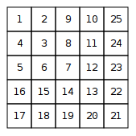

## 문제 정보

| 항목 | 내용 |
|------|------|
| 시간 제한 | 1.00s |
| 메모리 제한 | 512MB |
| 제출 일자 | 2026-04-24 |
| 소요 시간 | 0.40s |

## 문제 설명

[문제 링크](https://cses.fi/problemset/task/1071)

---

# Number Spiral

A number spiral is an infinite grid whose upper-left square has number 1. Here are the first five layers of the spiral: 

<br>

Your task is to find out the number in row $y$ and column $x$.

### Input
The first input line contains an integer $t$: the number of tests.
After this, there are $t$ lines, each containing integers $y$ and $x$.

### Output
For each test, print the number in row $y$ and column $x$.

### Constraints
* $1 \le t \le 10^5$
* $1 \le y, x \le 10^9$

### Example
**Input:**
```
3
2 3
1 1
4 2
```

**Output:**
```
8
1
15
```

<details markdown="1">
<summary><b>🇰🇷 한국어 번역 (클릭하여 펼치기)</b></summary>

# 숫자 나선 (Number Spiral)

숫자 나선은 왼쪽 위 칸에 1이 적혀 있는 무한한 격자입니다. 다음은 나선의 처음 다섯 층입니다.

<br>

당신의 임무는 $y$행 $x$열에 있는 숫자를 찾아내는 것입니다.

### 입력
첫 번째 입력 줄에는 테스트 케이스의 개수를 나타내는 정수 $t$가 주어집니다.
그 후 $t$개의 줄이 이어지며, 각 줄에는 정수 $y$와 $x$가 주어집니다.

### 출력
각 테스트 케이스에 대해 $y$행 $x$열에 있는 숫자를 출력합니다.

### 제한 사항
* $1 \le t \le 10^5$
* $1 \le y, x \le 10^9$

### 예제
**입력:**
```
3
2 3
1 1
4 2
```

**출력:**
```
8
1
15
```

</details>

---

## 초기 접근 및 로직 구상 방식

방향을 2번 바꾸면 +1칸 더 채운다.
처음은 2칸부터
방향 2번 바꾸면 방향다시 바꿔서 칸 채우고 남은 2칸 마저 채우기
이거를 반복하면 될거 같다고 생각을 했었는데,

굳이 배열에 넣을 필요가 있을까 라는 생각이 들었음.
다 넣기에는 x축 y축 10^9 라서 너무 커보이는데 메모리 낭비 심할거 같음.
그냥 요청받은 x,y값만 딱 주면 되는거 아닐까? - 근데 어떻게? 규칙이 보이는거 같기는 한데, 어떻게 수학 공식으로 옮길지 답이 안나와서 도움을 요청함..

> **힌트 1**
> 격자에서 y=x인 대각선 좌표들, 즉 (1,1), (2,2), (3,3), (4,4), (5,5)에 있는 숫자를 직접 적어보면 뭐가 보이나요?
{: .prompt-tip }

- 1 3 7 13 21 ... 계차 수열이네? 따라서 이걸로 n,n의 좌표의 값을 구할 수 있음.

> **힌트 2**
> 임의의 (y, x)가 주어졌을 때, 그 좌표가 대각선 기준으로 "어느 층"에 속하는지 — 그리고 그 층의 대각선 값에서 얼마나 떨어져 있는지를 어떻게 표현할 수 있을까요?
{: .prompt-tip }

- n,n 이니깐 n을 층으로 생각하고, n으로부터 x 또는 y중 같은 값을 찾고, 다른 값이 얼마나 떨어져있나 확인 하면 될 것 같음.


## 시도

**1차 시도.**
- 실패
시간 초과 발생 - 그 이유를 찾지 못함.

> **힌트 3**
> for 반복문을 몇번 돌까요?
{: .prompt-tip }

```java
for (int j = 1; j < n; j++) {
    a += j * 2;
}
```
위에 코드보면, 10^9 만큼 돌겠지, O(10^9) 라는 소리 아닌가? 엄청 느려보임.

> **힌트 4**
> 대각선 값을 이미 알고 있죠: 1, 3, 7, 13. 이 값들을 n²과 나란히 적어보면 뭔가 보이지 않나요?
{: .prompt-tip }

- n^2 - n + 1을 도출해 낼 수 있다.

**2차 시도.**
- 실패

틀린 값이 나옴.
확인해보니 오버플로우 발생해서 음수값이 나왔음.

계산되는 변수를 long으로 변경함.

## 배운 점

- 좌표를 층으로 묶을 수 있다.
- 변수형 크기 항상 고민해 볼것. 이번 문제에서는 조건값으로 1 <= y,x <= 10^9 를 줬고, 연산이 들어가면 2.1 × 10⁹ 을 초과하니깐 long을 쓰는게 맞다.
- 반복을 공식으로 옮길 수 없나 항상 확인할것. 이 편이 항상 빠르니깐.

## 최종 풀이 코드

```java

import java.io.BufferedReader;
import java.io.IOException;
import java.io.InputStreamReader;
import java.util.StringTokenizer;
 
public class NumberSpiral {
    public static void main(String[] args) throws IOException {
 
        BufferedReader br = new BufferedReader(new InputStreamReader(System.in));
        int t = Integer.parseInt(br.readLine());
 
        StringBuilder sb = new StringBuilder();
 
        for (int i = 0; i < t; i++) {
 
            StringTokenizer st = new StringTokenizer(br.readLine());
            int x = Integer.parseInt(st.nextToken());
            int y = Integer.parseInt(st.nextToken());
            long n = 0;
            long a = 1;
 
            if (x > y) {
                n = x;
            } else {
                n = y;
            }
 
            a = n * n - n + 1;
 
            if (n % 2 == 0) {
                if (x < n) {
                    a -= n - x;
                } else if (y < n) {
                    a += n - y;
                }
            } else {
                if (x < n) {
                    a += n - x;
                } else if (y < n) {
                    a -= n - y;
                }
            }
 
            sb.append(a).append("\n");
 
        }
 
        System.out.println(sb);
 
    }
}
```
